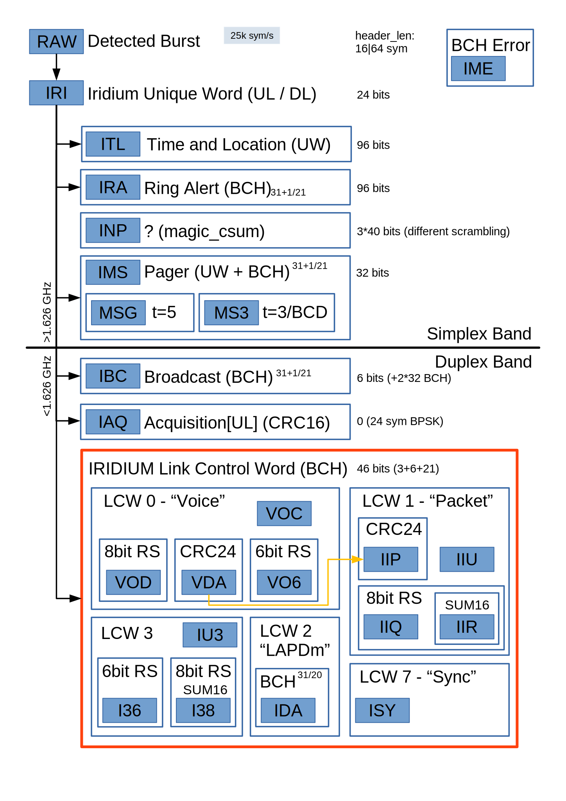

# iridium-parser output format guide

:warning: This format is continually evolving, so this documentation may not be 100% up to date.

## Overview

### Frame Header

All (parsed) frames start with a header:

Example:

    ISY: p-1472473197 000001626.1625 1621698688 100% -59.2|-116.2|21.7 179 DL
    IRA: p-1713996046-e000 000001278.7213 S.06|+10954  95% -68.40|-117.34|18.59 120 DL

Field|Content|Example|Comment
--:|-|-|-|
0|Frame type|ISY:|
1|UNIX timestamp in seconds when the recording started|p-1472473197|prefix is always "p-"
2|Time in milliseconds inside the recording|000001626.1625|resolution of up to 100ns
3|Frequency in Hertz|1627088000|Estimated center frequency
4|Confidence in percent|97%|Confidence is estimated during QPSK demodulation by gr-iridium
5|Signal levels|-59.2\|-116.2\|21.7|all in dBFS
6|Length in symbols|179|Excluding the 12 symbol sync word. One symbol equals two bits
7|Direction|DL|DL (sent by satellite) or UL (sent by user equipment)

Notes:

1. field 1 may contain a suffix of '-e000' where the three digits contain the number of corrected bit errors in each of the different parser stages (UW, header/LCW, payload/BCH). If more than 9 errors were corrected in any stage, the digit will still be 9.
2. field 3 will be in the format `subband.access|offset` when `--channelize` option is used. Subband can be `S` for Simplex or 01-30, Access can be 1-8, or 1-12 for the simplex subband. The offset will be in Hz.
3. Signal levels are "Signal, Noise, SNR" in that order. Signal strength is estimated by the demodulator stage of gr-iridium, while Noise floor & SNR are estimated by the burst-detector stage of gr-iridium.
4. Confidence is calculated as count(goodsymbols)/count(symbols), where goodsymbols have a deviation of less than 22° from a valid spot in the QPSK decoder.

### IRA: Ring Alert

Ring alerts are sent periodically by the satellite to every spot beam. For one satellite every 90 ms a new ring alert gets sent to another spot beam. There are 48 spot beams, so every 4.32 s a ring alert is sent to the same spot beam.

Example:

    IRA: [...] sat:016 beam:37 xyz=(+1396,+0711,+0862) pos=(+28.82/+026.99) alt=797 RAI:48 ?10 bc_sb:07 P01: PAGE(tmsi:113dbaf8 msc_id:02) {OK} FILL=10

Column|Content|Example|Comment
--:|-|-|-
8|Satellite number|sat:026|7 bit field, iridium internal ID
9|Spot beam number|beam:28|Spot beam ID (XXX: spot beam picture)
10|Satellite or spot beam position|xyz=(1006,0236,1210)|coordinates in ECEF format
11|Satellite or spot beam position|pos=(+46.64/-115.08)|field 10 converted to lat/lon degrees
12|Satellite or spot beam altitude|alt=791|In km
12|Ring alert interval|RAI:48|Always 48 in the live system
13|Unknown|?10|2 bits
14|Broadcast channel sub-band|bc_sb:14|Brodcast channel for the spot beam is in this sub-band
15-|TMSI pages|PAGE(tmsi:06f164d4 msc_id:03) {OK}|OK indicates a properly terminated list of pages
  |Fill count|FILL=10|amount of end-of-packet padding

Notes:

1. As there can be a different amount of pages, the size of a ring alert frame is not constant.
1. Field 11/12 is a rough conversion (geocentric latitude instead of proper geodetic latitude) check source for details

#### Satellite number

The satellite number is an iridium internal ID in the range of 0-127. This differs from the generally used "Object Name".

Check `reassembler -m satmap` on how to create a mapping between these two.

#### Spot beam

The spot beams positions differ between the (decomissioned) original iridium satellites and the iridium-next satellites.

A graphical representation can be created with `beam-plotter.py`

#### Location Information

The ring alert contains two different, alternating, locations:

##### SV Location

Locations with a high altitude (> 100 km) represent the current location of the SV (Space Vehicle).

##### Spot Beam Location

Locations with a low altitude (< 10 km) represent the location where the SV thinks that this particular spot beam is hitting the earth’s surface. Note that this is not the location of a subscriber.

### IMS: Messaging (pager)

   IMS: [...] 8:A:01 len:03/T1/F00 1 0 101011100010010000000 000000000000000000000 000000000000000000000 000000000000000000000

Column|Content|Example|Comment
--:|-|-|-
8|block:group:frame|8:A:01|
9|Length|len:03|length in BCH blocks (21 bits)
||Trailer length|T1|number of trailer blocks
||Fill length|F00|number of filler blocks
10|unknown|1|1 bit
11|secondary|0|1 bit
12-15|block header message||

fields 11-16 are only present if group is "A"

#### block:group:frame

block: Block number in the super frame
group: A (for Aquisition) or 0-3
frame: Current frame number

#### Trailer length

Packet may have up to 2 all-1 trailer blocks

#### secondary

unclear

#### block header message

a 63 bit message. Contents yet unknown

### MSG:

    MSG: [...] 8:0:01 len:13/T1/F00 ric:3525766 fmt:05 seq:30 1000100011 0/0 csum:0b msg:ab9e24d990f0e56d0b2c5d796358df2b7c788aed47eae66b4e1df8ab970d9cdd9c6177b56694d934b3c6cdcf8628b6a0c6e5bf8b0f. TXT: UgDMLCae6BeEkeFXoJoGD+ZGu9M4pwq+KC3MlqBwZYRMIRgFfspbEZAFroq0

This is a specialisation of an IMS message, so for the beginning see IMS

Column|Content|Example|Comment
--:|-|-|-
10|radio identification code|ric:3525766|
11|format|fmt:05|5 for ascii, 3 for BCD
12|sequence no.|seq:30|5-bit field, incrementing for messages to the same ric
13|unknown|1000100011
14|part counter|0/0|counter for multi-part messages. 0-based
15|checksum|csum:0b|inverted 7-bit sum
16|message|msg:hex.bits|represented in hex with remaining non-multiple-of-8 bits appended as string of 0/1
17-|Ascii representation||message converted to ascii

#### ric
The radio identifier code is used by the pager to filter messages intended for itself. It has no correlation with the phone number assigned to that pager.

#### part counter
A pager message may consist of up to three parts (0-2) that will form a complete message.

#### reassembly
`reassembler -m msg` can be used to assemble multi-part messages and print them in a more readable format.

### MS3:

similar to MSG, for BCD messages. Very rare

### ITL: Time & Location

    ITL: [...] V2 OK[0] P4 S10 N02 1011111 1000110 0111001

ITL packets consist of a long fixed header and several PRS (pseudorandom sequences) that encode data so it can be received in adverse signal conditions.

See [itl.py](itl.py) for a list of these PRS values.

ITL Packets contain the current time (LBFC) spread over multiple messages.

Column|Content|Example|Comment
--:|-|-|-
8|version|V2|
9||OK[0]|0 is the PRS category (0-3)
10|plane|P4|plane that the satellite is on (1-6)
11|sat|S10|satellite index (1-11) on the current plane
12|message type|M03|
13-15|data|1011111 1000110 0111001|3 * 7 bit

Notes:
1. Version seems to be currently 2
2. based on the message type the sat field can be empty or contain Rxx which is a relative identifier (satno mod 3)

#### itlmap
`reassembler.py -m itlmap` will create a mapping between iridium internal satellite "id" and their position inside the constellation (plane / index)

### INP: "new packet"

Work in progress.

### IBC: Broadcast

    IBC: [...] bc:0 sat:028 cell:32 0 slot:0 sv_blkn:0 aq_cl:1111111111111111 aq_sb:22 aq_ch:2 00 0000 tmsi_expiry:2020-06-25T14:18:30.44Z [0 Rid:119 ts:1 ul_sb:22 dl_sb:22 access:3 dtoa:001 dfoa:00 00] []
    IBC: [...] bc:0 sat:028 cell:24 0 slot:0 sv_blkn:0 aq_cl:1111111111111111 aq_sb:19 aq_ch:2 00 0000 time:2022-01-04T23:00:48.89Z [] []
    IBC: [...] bc:0 sat:028 cell:24 0 slot:0 sv_blkn:0 aq_cl:1111111111111111 aq_sb:19 aq_ch:2 00 101010110001111001000111110000 max_uplink_pwr:20 [] []

IBC can optionally have one of three information sets followed by channel assignments

Column|Content|Example|Comment
--:|-|-|-
8||bc:0|
9|satellite id|sat:028|same 7-bit-id as in `IRA`
10|cell id|cell:32|a.k.a. spot beam number
11|unknown|0|1 bit
12|slot|slot:0|1 bit
13|sv_blocking|sv_blkn:0|1 bit
14|acquisition classes|aq_cl:1111111111111111|bitfield
15|acquisition subband|aq_sb:19|
16|acquisition channel|aq_ch:2|
17|unknown02|00|2 bits

#### variant 1:

Column|Example|Comment
--:|-|-
18|0000|
19|tmsi_expiry:2020-06-25T14:18:30.44Z|seems to be mostly constant

#### variant 2:

Column|Example|Comment
--:|-|-
18|0000|
19|time:2022-01-04T23:00:48.89Z|L-Band Frame Counter, 90ms granularity

#### variant 3:

Column|Example|Comment
--:|-|-
18|101010110001111001000111110000|unknown
19|max_uplink_pwr:20|seems to be constant

#### Channel Assigments
    [0 Rid:119 ts:1 ul_sb:22 dl_sb:22 access:3 dtoa:001 dfoa:00 00]
  The channel assignment are sent in response to `IAQ` requests from a mobile terminal and assign a frequency & timeslot for further communication.

Content|Example|Comment
-|-|-
type|0|0-7
random id|Rid:119|matches rid from `IAQ` packet
timeslot|ts:1|1-4
uplink subband|ul_sb:22|
downlink subband|dl_sb:22|
frequency_access|access:3|
delta time of arrival|dtoa:+005|signed
delta frequency of arrival|dfoa:00|signed
unknown|00|2 bits|

Notes:
1. Type 7 is likely used for iridium "next generation" devices and currently not understood.

### IAQ: Acquisition

    IAQ: [...] 1000 Rid:189 CRC:OK

 `IAQ` packets are encoded in BPSK and are sent by mobile terminals trying to connect to the network.

Column|Content|Example|Comment
--:|-|-|-
8||1000|4 bits, first is a "final" bit
9|random id|Rid:189|8 bit, chosen by MT
10|crc|CRC:OK|14 bits of a 16bit crc

### LCW: Link control word

The remaining frames (`VOC`, `IU3`, `IDA`, `IIP`, `ISY` and their subtypes) contain a Link control word at the beginning

    LCW(2,T:maint,C:switch[dtoa:0,dfoa:1],000)

The contents are diverse and contain e.g. information about handovers, frequency as well as time adjustments or selective "ack" information for multi-frame messages.

### VOC
Contain voice data

### IU3
Not much is known

### IDA
Contain LAPDm messages potentially split over multiple frames
Use `reassembler -m idapp` to decode

### IIP
Contain data transmissions (e.g. PPP or RUDICS)

### ISY
Contain a constant bit pattern, used mainly to transmit info via the LCW
